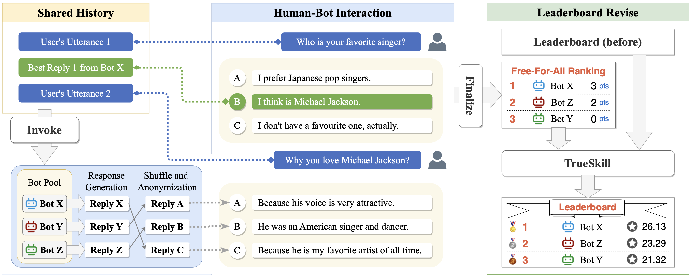

# FFAEVAL: Evaluating Dialogue System via Free-For-All Ranking



## Platform

### Backend

**Install the dependent libraries.**

```
pip install -r requirements.txt
```

**Model deployment**: our platform support openai compatible api. You can use library like vLLM to serve your model.

**Install mongodb v7.0.2.**

Change the mongodb config in platform/backend/mongodb.py

**Add models to be evaluated.**

```
cd platform/backend
python modify_model --action add --model_name MODEL --api_key API_KEY --base_url BASE_URL
```

You can also deactivate/activate/delete model.
```
python modify_model -action deactivate --model_name MODEL
python modify_model -action activate --model_name MODEL
python modify_model -action delete --model_name MODEL
```

**Run backend.**
```
flask --app app run --host=IP_ADDRESS --port=PORT
```

**Calculate Result.**
```
python main_result.py
```

### Frontend

**Change the vue config**

Modify platform/frontend/vite.config.js. Change the proxy target.

**Change IP Adress in ChatRoom.vue**

Change the IP Adress of method websocket in platform/frontend/src/components/ChatRoom.vue

**Project setup**

```
npm install
```

**Compile and Hot-Reload for Development**

```
npm run dev
```

**Compile and Minify for Production**

```
npm run build
```

## Data

en.jsonl: The responses of English models we collect on our framework.

en.jsonl: The responses of Chinese models we collect on our framework.

## Citation

If you find our work helpful, feel free to give us a cite.
```
@inproceedings{ma2023ffaeval,
  title={FFAEval: Evaluating Dialogue System via Free-For-All Ranking},
  author={Ma, Zeyao and Yao, Zijun and Zhang, Jing and Yu, Jifan and Zhang, Xiaohan and Li, Juanzi and Tang, Jie},
  booktitle={Findings of the Association for Computational Linguistics: EMNLP 2023},
  pages={15672--15684},
  year={2023}
}
```